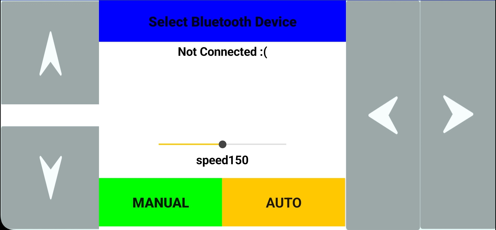

# Arduino Smart Car with MIT App Inventor Control

## Description
This project is a **Bluetooth-controlled car** built using **Arduino**, the **AFMotor library**, and a **Servo** for obstacle detection.  
It can be controlled via a **custom MIT App Inventor application**, offering two operation modes:

- **Manual Mode**: Drive the car using app buttons (forward, backward, left, right, diagonal, stop).  
- **Automatic Mode**: The car navigates autonomously using an ultrasonic sensor to detect and avoid obstacles.

The app communicates with Arduino via an **HC-05 Bluetooth module**.

---

## Features
- **Manual driving** via MIT App Inventor app.  
- **Automatic obstacle avoidance** using an ultrasonic sensor.  
- **Two modes** (switchable by app):
  - **M (Manual)**  
  - **A (Automatic)**  
- **Adjustable speed** using commands (`Vxxx`).  
- **LED indicator** for manual/auto mode.  
- Supports **diagonal movement with curves** for smoother driving.  

---

## Hardware Requirements
- Arduino Uno / Mega  
- L293D Motor Shield (Adafruit AFMotor library)  
- 4 DC Motors with wheels  
- Servo motor (for ultrasonic scanning)  
- Ultrasonic sensor (HC-SR04)  
- Bluetooth module (HC-05/HC-06)    
- **Power supply: 2x Li-Po batteries (7.4V, 6800mAh)**  

---

## Software Requirements
- **Arduino IDE** with libraries:
  - `AFMotor.h`  
  - `Servo.h`  
- **MIT App Inventor** (for building the Android app)  

---

## How It Works
1. Upload the Arduino code to your board.  
2. Connect the HC-05 Bluetooth module to the Arduino.  
3. Pair your phone with the HC-05 module.  
4. Install and run the MIT App Inventor app.  
5. Use the app to switch between:
   - **Manual mode (M)** → control the car directly.  
   - **Automatic mode (A)** → car avoids obstacles autonomously.  

---

## MIT App Inventor Commands
- **A** → Switch to automatic mode.  
- **M** → Switch to manual mode.  
- **Vxxx** → Set speed (e.g., `V150`).  
- **F** → Forward.  
- **B** → Backward.  
- **L** → Left.  
- **R** → Right.  
- **FR / FL / BR / BL** → Diagonal movements.  
- **S** → Stop.  

---
## App Interface

This is the control interface built with **MIT App Inventor**.  
It allows switching between **Manual** and **Auto** modes, adjusting speed, and controlling direction.

---

## Future Improvements
- Add line-following sensors.  
- Implement smartphone tilt control (gyroscope).  
- Add camera streaming for remote driving.  

---

## Author
Kareem Ahmed

